# ARQUITECTURA TÉCNICA COMPLETA - MILANA by BDOvenbird

**Última actualización:** 2025-01-23
**Versión:** 1.0

---

## 📋 ÍNDICE

1. [Descripción General](#descripción-general)
2. [Arquitectura del Sistema](#arquitectura-del-sistema)
3. [Implementación de IAs](#implementación-de-ias)
4. [Detalles Técnicos por IA](#detalles-técnicos-por-ia)
5. [Manifest V3 - Fixes Aplicados](#manifest-v3---fixes-aplicados)
6. [Flujo de Datos](#flujo-de-datos)
7. [Troubleshooting](#troubleshooting)

---

## 🎯 DESCRIPCIÓN GENERAL

**Milana** es una extensión de Chrome (Manifest V3) que permite interactuar simultáneamente con múltiples servicios de IA mediante **peticiones directas a sus APIs internas**, utilizando la sesión autenticada del usuario.

### Características Principales

- ✅ **Peticiones Directas**: No abre pestañas, hace fetch desde Service Worker
- ✅ **Streaming en Tiempo Real**: Server-Sent Events (SSE) para respuestas progresivas
- ✅ **4 IAs Implementadas**: ChatGPT, Gemini, Claude, Perplexity
- ✅ **Sin API Keys**: Usa las sesiones del navegador del usuario
- ✅ **Manifest V3 Compliant**: Compatible con las últimas especificaciones de Chrome

---

## 🏗️ ARQUITECTURA DEL SISTEMA

### Estructura de Archivos

```
Milana/
├── manifest.json                      # Configuración MV3
├── background_streaming.js            # Service Worker principal
├── sha3.js                           # Librería SHA3-512 para ChatGPT
├── content_script_direct_api.js      # Content Script (Main World)
├── index.html                        # Interfaz popup
├── sidebar.js / sidebar.css          # Sidebar flotante
├── icons/                            # Iconos de la extensión
├── js/                               # Scripts de la UI
│   ├── app.js                        # Lógica principal UI
│   ├── settings-manager.js           # Gestión de configuración
│   ├── winner-system.js              # Sistema de ganadores
│   ├── sequential-mode.js            # Modo secuencial
│   └── background-handler.js         # Comunicación background
├── styles/                           # Estilos
│   ├── main.css                      # Estilos base
│   └── modern.css                    # Tema actual
└── docs/                             # Documentación técnica
```

### Componentes Principales

#### 1. Service Worker (background_streaming.js)

**Responsabilidades:**
- Gestionar peticiones HTTP a las APIs de las IAs
- Mantener contextos de conversación persistentes
- Procesar streaming SSE
- Calcular proof-of-work para ChatGPT
- Comunicarse con la UI via `chrome.runtime.sendMessage`

**Tecnologías:**
- Fetch API con `credentials: 'include'`
- ReadableStream para SSE
- chrome.storage.local para persistencia
- importScripts para librería SHA3

#### 2. Content Script (content_script_direct_api.js)

**Responsabilidades:**
- Inyectarse en Main World para acceder a cookies
- Extraer tokens AT y BL de Gemini desde el DOM
- Comunicarse con Service Worker

**Modo de Inyección:**
```javascript
// manifest.json
"content_scripts": [{
    "matches": ["*://gemini.google.com/*", ...],
    "js": ["content_script_direct_api.js"],
    "run_at": "document_end"
}]
```

#### 3. Interfaz de Usuario (index.html + js/)

**Responsabilidades:**
- Mostrar selector de IAs con descripciones
- Textarea para prompt
- Grid de 3 columnas para respuestas
- Streaming en tiempo real
- Configuración y ajustes

---

## 🤖 IMPLEMENTACIÓN DE IAS

### Método General: Peticiones Directas desde Service Worker

Todas las IAs funcionan con el mismo patrón:

1. **Obtener credenciales** (tokens, organization IDs, etc.)
2. **Preparar payload** (prompt, contexto, configuración)
3. **Enviar petición POST** con `credentials: 'include'`
4. **Procesar streaming SSE** con ReadableStream
5. **Enviar updates** al UI con `chrome.runtime.sendMessage`

---

## 📡 DETALLES TÉCNICOS POR IA

### 1. GEMINI (Google)

#### Endpoints

```
GET  https://gemini.google.com/
POST https://gemini.google.com/_/BardChatUi/data/assistant.lamda.BardFrontendService/StreamGenerate
```

#### Flujo de Autenticación

1. **Obtener tokens del HTML:**
```javascript
async function getGeminiParams() {
    const response = await fetch('https://gemini.google.com/', {
        credentials: 'include'
    });
    const html = await response.text();

    // Extraer SNlM0e (token AT)
    const atValue = extractFromHTML('SNlM0e', html);

    // Extraer cfb2h (BL value)
    const blValue = extractFromHTML('cfb2h', html);

    return { atValue, blValue };
}
```

2. **Construir URL con parámetros:**
```javascript
const reqId = Math.floor(Math.random() * 1000000);
const url = `https://gemini.google.com/_/BardChatUi/data/assistant.lamda.BardFrontendService/StreamGenerate?bl=${blValue}&_reqid=${reqId}&rt=c`;
```

#### Estructura del Payload

```javascript
const payload = [
    null,
    JSON.stringify([
        [prompt, 0, null, []],  // [texto, tipo, imagen, archivos]
        null,
        ["", "", ""]            // IDs de contexto (vacíos = nueva conversación)
    ])
];

const formData = new URLSearchParams({
    "f.req": JSON.stringify(payload),
    "at": atValue  // Token de autenticación
});
```

#### Headers

```http
POST /path/to/endpoint
Content-Type: application/x-www-form-urlencoded;charset=UTF-8
Cookie: [cookies del navegador automáticas]
```

#### Procesamiento de Respuesta

```javascript
// Formato de respuesta: múltiples líneas JSON
const lines = responseText.split('\n');

for (const line of lines) {
    if (line.trim().length === 0) continue;

    const parsed = JSON.parse(line);
    const data = JSON.parse(parsed[0][2]);

    // Extraer texto de respuesta
    const responseText = data[4][0][1][0];

    // Extraer IDs para siguiente mensaje
    const contextIds = [...data[1], data[4][0][0]];
}
```

#### Contexto de Conversación

```javascript
let geminiConversationContext = {
    requestParams: { atValue, blValue },
    contextIds: ["", "", ""]  // Se actualiza con cada respuesta
};
```

---

### 2. CHATGPT (OpenAI)

#### Endpoints

```
GET  https://chatgpt.com/api/auth/session
POST https://chatgpt.com/backend-api/sentinel/chat-requirements
POST https://chatgpt.com/backend-api/conversation
```

#### Flujo de Autenticación

1. **Obtener Access Token:**
```javascript
async function getChatGPTAccessToken() {
    const response = await fetch('https://chatgpt.com/api/auth/session', {
        credentials: 'include'
    });
    const session = await response.json();
    return session.accessToken;
}
```

2. **Obtener Chat Requirements:**
```javascript
async function getChatRequirements(accessToken) {
    const response = await fetch('https://chatgpt.com/backend-api/sentinel/chat-requirements', {
        method: 'POST',
        headers: {
            'Authorization': `Bearer ${accessToken}`,
            'Content-Type': 'application/json'
        },
        body: JSON.stringify({})
    });

    const data = await response.json();
    return {
        token: data.token,
        proofofwork: data.proofofwork
    };
}
```

3. **Calcular Proof-of-Work (si requerido):**
```javascript
async function generateComplexProofToken(seed, difficulty) {
    // Importar SHA3-512
    importScripts('sha3.js');

    const config = getBrowserConfig();
    const diffLen = difficulty.length / 2;

    // Buscar hash que cumpla la dificultad
    for (let i = 0; i < 100000; i++) {
        const base = `${seed}${JSON.stringify(config)}${i}`;
        const hash = sha3_512(base);

        if (hash.substring(0, diffLen) <= difficulty) {
            const answer = i.toString();
            return `gAAAAAB${btoa(answer)}`;  // Formato específico de OpenAI
        }
    }
}
```

#### Estructura del Payload

```javascript
const body = {
    action: 'next',
    arkose_token: null,
    conversation_id: conversationId || undefined,
    conversation_mode: { kind: 'primary_assistant' },
    force_paragen: false,
    force_rate_limit: false,
    history_and_training_disabled: false,
    messages: [{
        id: generateUUID(),
        author: { role: 'user' },
        content: {
            content_type: 'text',
            parts: [prompt]
        }
    }],
    model: 'auto',  // o 'gpt-4', 'gpt-3.5-turbo', etc.
    parent_message_id: parentMessageId || generateUUID(),
    timezone: 'Europe/Madrid'
};
```

#### Headers

```http
POST /backend-api/conversation
Authorization: Bearer [accessToken]
Content-Type: application/json
Oai-Device-Id: [UUID persistente]
Oai-Language: es-ES
Openai-Sentinel-Chat-Requirements-Token: [token]
Openai-Sentinel-Proof-Token: [proof-token si requerido]
Cookie: [cookies automáticas]
```

#### Procesamiento de Streaming SSE

```javascript
const reader = response.body.getReader();
const decoder = new TextDecoder();

while (true) {
    const { done, value } = await reader.read();
    if (done) break;

    const chunk = decoder.decode(value);
    const lines = chunk.split('\n');

    for (const line of lines) {
        if (!line.startsWith('data: ')) continue;
        if (line === 'data: [DONE]') break;

        const jsonStr = line.substring(6);
        const data = JSON.parse(jsonStr);

        if (data.message?.content?.parts?.[0]) {
            const text = data.message.content.parts[0];
            // Enviar update al UI
        }
    }
}
```

#### Device ID Persistente

```javascript
async function getDeviceId() {
    const result = await chrome.storage.local.get(['oai_device_id']);
    let deviceId = result.oai_device_id;

    if (!deviceId) {
        deviceId = generateUUID();
        await chrome.storage.local.set({ 'oai_device_id': deviceId });
    }

    return deviceId;
}
```

---

### 3. CLAUDE (Anthropic)

#### Endpoints

```
GET  https://claude.ai/api/organizations
POST https://claude.ai/api/organizations/{org_uuid}/chat_conversations
POST https://claude.ai/api/organizations/{org_uuid}/chat_conversations/{conv_id}/completion
```

#### Flujo de Autenticación

1. **Obtener Organization UUID:**
```javascript
async function getClaudeOrganizationId() {
    const response = await fetch('https://claude.ai/api/organizations', {
        redirect: 'error',
        cache: 'no-cache',
        credentials: 'include'
    });

    if (response.status === 403) {
        throw new Error('Please sign in to your Claude account');
    }

    const organizations = await response.json();

    // Filtrar por capability "chat"
    const chatOrg = organizations.filter(org =>
        org.capabilities.includes('chat')
    )[0];

    return chatOrg ? chatOrg.uuid : organizations[0].uuid;
}
```

2. **Crear Conversación:**
```javascript
async function createClaudeConversation(organizationId) {
    const conversationId = generateUUID();

    await fetch(`https://claude.ai/api/organizations/${organizationId}/chat_conversations`, {
        method: 'POST',
        headers: {
            'Content-Type': 'application/json'
        },
        body: JSON.stringify({
            name: '',
            uuid: conversationId
        }),
        credentials: 'include'
    });

    return conversationId;
}
```

#### Estructura del Payload

```javascript
const body = {
    prompt: prompt,
    files: [],  // Array de UUIDs de archivos subidos
    rendering_mode: 'raw',
    attachments: []
};
```

#### Headers

```http
POST /api/organizations/{org_id}/chat_conversations/{conv_id}/completion
Content-Type: application/json
Cookie: [cookies automáticas - incluye sessionKey]
```

#### Procesamiento de Streaming

```javascript
const reader = response.body.getReader();
const decoder = new TextDecoder();

while (true) {
    const { done, value } = await reader.read();
    if (done) break;

    const chunk = decoder.decode(value);
    const lines = chunk.split('\n');

    for (const line of lines) {
        if (!line.startsWith('data: ')) continue;

        const jsonStr = line.substring(6);
        if (jsonStr === '[DONE]') continue;

        const data = JSON.parse(jsonStr);

        if (data.completion) {
            fullText += data.completion;
            // Enviar update
        } else if (data.error) {
            throw new Error(JSON.stringify(data.error));
        }
    }
}
```

#### Contexto de Conversación

```javascript
let claudeConversationContext = {
    organizationId: 'uuid-aqui',
    conversationId: 'uuid-aqui'
};
```

---

### 4. PERPLEXITY

#### Endpoint

```
POST https://www.perplexity.ai/rest/sse/perplexity_ask
```

#### Headers Modificados

⚠️ **Importante:** Perplexity requiere que el header `Origin` sea modificado por las reglas de la extensión:

```json
// src/rules/pplx.json (NO USADO en MV3)
{
    "action": {
        "type": "modifyHeaders",
        "requestHeaders": [{
            "header": "origin",
            "operation": "set",
            "value": "https://labs.perplexity.ai"
        }]
    }
}
```

**Nota MV3:** Las reglas de modificación de headers no funcionan para peticiones del Service Worker. El Origin correcto se envía automáticamente.

#### Estructura del Payload

```javascript
const body = {
    params: {
        search_focus: 'internet',
        sources: ['web'],
        last_backend_uuid: null,  // UUID de mensaje anterior para contexto
        mode: 'copilot',
        model_preference: 'pplx_pro',
        supported_block_use_cases: [],
        version: '2.18'
    },
    query_str: prompt
};
```

#### Headers

```http
POST /rest/sse/perplexity_ask
Content-Type: application/json
Origin: https://labs.perplexity.ai
Cookie: [cookies automáticas]
```

#### Procesamiento de Streaming SSE

```javascript
const reader = response.body.getReader();
const decoder = new TextDecoder();

while (true) {
    const { done, value } = await reader.read();
    if (done) break;

    const chunk = decoder.decode(value);
    const lines = chunk.split('\n');

    for (const line of lines) {
        if (!line.startsWith('data: ')) continue;

        const jsonStr = line.substring(6);
        if (jsonStr === '[DONE]') continue;

        const data = JSON.parse(jsonStr);

        if (data.final_sse_message) {
            // Guardar UUID para siguiente mensaje
            const backendUuid = data.backend_uuid;

            // Parsear respuesta anidada (2 niveles de JSON)
            const textData = JSON.parse(data.text);
            const finalStep = textData.find(step => step.step_type === 'FINAL');

            if (finalStep) {
                const answerData = JSON.parse(finalStep.content.answer);
                const answer = answerData.answer;
                // Enviar update
            }
        }
    }
}
```

#### Contexto de Conversación

```javascript
let perplexityConversationContext = {
    lastBackendUuid: null  // Se actualiza con cada respuesta
};
```

---

## 🔧 MANIFEST V3 - FIXES APLICADOS

### Problema 1: Worker is not defined

**Error Original:**
```
ReferenceError: Worker is not defined
```

**Causa:**
Service Workers en Manifest V3 no soportan `new Worker()`.

**Solución:**
```javascript
// ❌ Antes (no funciona en MV3)
const worker = new Worker('proof-worker.js');

// ✅ Después (MV3 compatible)
importScripts('sha3.js');

function calculateProofOfWorkSync(seed, difficulty) {
    // Cálculo inline
    for (let i = 0; i < 100000; i++) {
        const hash = sha3_512(`${seed}${config}${i}`);
        if (hash.substring(0, diffLen) <= difficulty) {
            return formatProof(i);
        }
    }
}

// Wrapper async para no bloquear
async function generateComplexProofToken(seed, difficulty) {
    return await new Promise((resolve) => {
        setTimeout(() => {
            const result = calculateProofOfWorkSync(seed, difficulty);
            resolve(result);
        }, 0);
    });
}
```

**Consecuencia:**
- Proof-of-work tarda 5-15 segundos (en vez de instantáneo)
- Es aceptable porque no bloquea el UI

---

### Problema 2: screen is not defined

**Error Original:**
```
ReferenceError: screen is not defined
```

**Causa:**
Service Workers no tienen acceso a APIs del DOM como `screen`, `window`, `document`.

**Solución:**
```javascript
// ❌ Antes
function getBrowserConfig() {
    return [
        navigator.hardwareConcurrency,
        screen.width,  // ❌ No existe en Service Worker
        screen.height  // ❌ No existe en Service Worker
    ];
}

// ✅ Después
function getBrowserConfig() {
    const cores = navigator.hardwareConcurrency || 4;
    const screenWidth = 1920;   // Valor por defecto
    const screenHeight = 1080;  // Valor por defecto

    return [
        cores + screenWidth + screenHeight,
        new Date().toString(),
        0,  // performance.memory tampoco existe
        0,
        navigator.userAgent
    ];
}
```

---

### Problema 3: localStorage is not defined

**Error Original:**
```
ReferenceError: localStorage is not defined
```

**Causa:**
Service Workers deben usar `chrome.storage` en vez de `localStorage`.

**Solución:**
```javascript
// ❌ Antes
function getDeviceId() {
    let deviceId = localStorage.getItem('oai_device_id');

    if (!deviceId) {
        deviceId = generateUUID();
        localStorage.setItem('oai_device_id', deviceId);
    }

    return deviceId;
}

// ✅ Después (async obligatorio)
async function getDeviceId() {
    try {
        const result = await chrome.storage.local.get(['oai_device_id']);
        let deviceId = result.oai_device_id;

        if (!deviceId) {
            deviceId = generateUUID();
            await chrome.storage.local.set({ 'oai_device_id': deviceId });
        }

        return deviceId;
    } catch (error) {
        console.error('[ChatGPT] Error con storage:', error);
        return generateUUID();  // Fallback
    }
}

// ⚠️ IMPORTANTE: Todos los llamados deben ahora usar await
const deviceId = await getDeviceId();
```

---

## 🔄 FLUJO DE DATOS

### Envío de Prompt

```mermaid
graph TD
    A[Usuario escribe prompt] --> B[app.js captura submit]
    B --> C{¿Qué IAs seleccionadas?}
    C --> D[chrome.runtime.sendMessage]
    D --> E[background_streaming.js recibe]
    E --> F{Por cada IA}
    F --> G1[sendToGeminiDirect]
    F --> G2[sendToChatGPTDirect]
    F --> G3[sendToClaudeDirect]
    F --> G4[sendToPerplexityDirect]
    G1 --> H1[Procesar streaming]
    G2 --> H2[Procesar streaming]
    G3 --> H3[Procesar streaming]
    G4 --> H4[Procesar streaming]
    H1 --> I[chrome.runtime.sendMessage con updates]
    H2 --> I
    H3 --> I
    H4 --> I
    I --> J[app.js muestra en UI]
```



### Streaming en Tiempo Real

```javascript
// Background: Enviar chunks progresivamente
chrome.runtime.sendMessage({
    type: 'STREAM_UPDATE',
    ai: 'gemini',
    text: accumulatedText
});

// UI: Recibir y renderizar
chrome.runtime.onMessage.addListener((message) => {
    if (message.type === 'STREAM_UPDATE') {
        const column = document.querySelector(`[data-ai="${message.ai}"]`);
        column.querySelector('.response-content').textContent = message.text;
    }
});
```

---

## 🐛 TROUBLESHOOTING

### Gemini No Responde

**Síntoma:**
```
Error: No se pudieron extraer los tokens
```

**Solución:**
1. Verificar sesión activa en https://gemini.google.com
2. Recargar extensión en `chrome://extensions`
3. Comprobar que `SNlM0e` y `cfb2h` existen en el HTML

**Debug:**
```javascript
// En console de gemini.google.com
console.log(document.body.innerHTML.includes('SNlM0e'));
console.log(document.body.innerHTML.includes('cfb2h'));
```

---

### ChatGPT No Responde

**Síntoma:**
```
Error: There is no logged-in ChatGPT account
```

**Solución:**
1. Iniciar sesión en https://chatgpt.com
2. Verificar que no haya Cloudflare challenge activo
3. Esperar proof-of-work (5-15 segundos es normal)

**Debug:**
```javascript
// Verificar access token
fetch('https://chatgpt.com/api/auth/session', {credentials:'include'})
    .then(r => r.json())
    .then(d => console.log(d.accessToken ? 'OK' : 'No token'));
```

---

### Claude No Responde

**Síntoma:**
```
Error: Please sign in to your Claude account
```

**Solución:**
1. Iniciar sesión en https://claude.ai
2. Verificar que la organización tenga capability "chat"

**Debug:**
```javascript
// Verificar organizations
fetch('https://claude.ai/api/organizations', {credentials:'include'})
    .then(r => r.json())
    .then(orgs => console.log(orgs));
```

---

### Perplexity No Responde

**Síntoma:**
```
Error: Perplexity access forbidden (403)
```

**Solución:**
1. Visitar https://www.perplexity.ai
2. Resolver cualquier CAPTCHA si aparece
3. Iniciar sesión si no lo está

---

## 📚 REFERENCIAS

### Código Base
- **ChatHub 3.99.4_0**: Implementación de referencia
- **js-sha3**: Librería para proof-of-work

### APIs Documentadas
- OpenAI ChatGPT: Ingeniería inversa de peticiones
- Google Gemini: BardChatUi API interna
- Anthropic Claude: API web no documentada
- Perplexity: REST API interna

### Especificaciones
- [Chrome Extension Manifest V3](https://developer.chrome.com/docs/extensions/mv3/)
- [Service Workers API](https://developer.mozilla.org/en-US/docs/Web/API/Service_Worker_API)
- [Server-Sent Events](https://developer.mozilla.org/en-US/docs/Web/API/Server-sent_events)

---

**Autor:** BDOvenbird
**Licencia:** MIT
**Contacto:** [Información de contacto]
